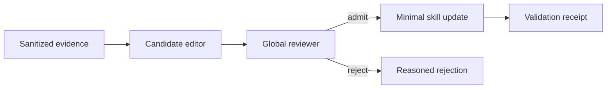

# Agent Skill Governance

[中文](README.zh-CN.md) · English

A public, implementation-neutral design note for turning noisy agent experience into small, reviewable skill updates.

This repository focuses on the governance layer around skill evolution:

- collect evidence without copying sensitive context;
- route each candidate to one clear owner;
- merge duplicates before editing;
- prefer conditional guidance over universal claims;
- keep changes minimal, traceable, and reversible;
- reject weak, private, or overly specific candidates.

## Public skill set

- [`candidate-skill-editor`](skills/candidate-skill-editor/SKILL.md): convert one evidence-backed observation into a bounded edit proposal.
- [`global-skill-reviewer`](skills/global-skill-reviewer/SKILL.md): deduplicate candidates, resolve ownership, and make admission decisions across a skill set.

Supporting policies live in [`references/`](references/).

## What is intentionally excluded

No employer code, internal platform terminology, production data, logs, prompts, credentials, private paths, or proprietary workflows are included. The material is an independent public reconstruction of general engineering principles. It is documentation-only and does not expose any original implementation.

## Status

Portfolio artifact and design reference. It is not a drop-in production framework.

## License

Documentation is shared for reading and discussion. Add a license only after confirming the intended reuse terms.
