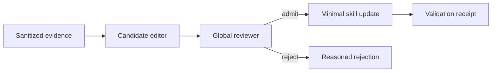
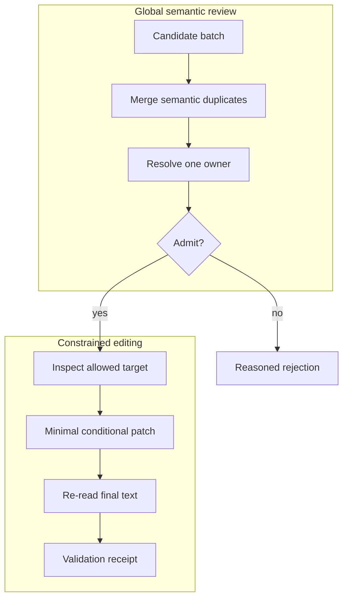
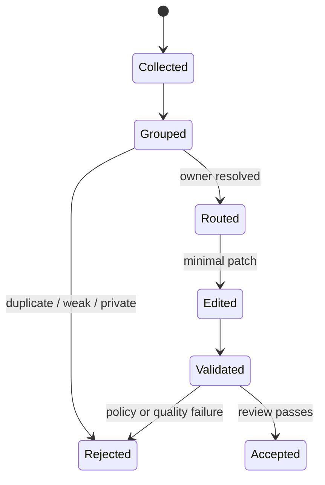

# Agent Skill Governance

[中文](README.zh-CN.md) · English

A public, implementation-neutral design note for turning noisy agent experience into small, reviewable skill updates.

## Innovation focus

1. **One semantic decision per candidate** — batching and deduplication happen before editing, so the same lesson cannot quietly spread across several skills.
2. **Evidence-calibrated language** — wording strength is constrained by evidence strength; a failure boundary cannot become an unconditional command.
3. **Owner-aware admission** — a useful lesson is rejected or rerouted when the selected file is not its narrowest legitimate owner.

This repository focuses on the governance layer around skill evolution:

- collect evidence without copying sensitive context;
- route each candidate to one clear owner;
- merge duplicates before editing;
- prefer conditional guidance over universal claims;
- keep changes minimal, traceable, and reversible;
- reject weak, private, or overly specific candidates.



## Two-stage governance



The global reviewer decides meaning and ownership. The local editor receives a narrow target and cannot expand scope.

## Candidate lifecycle



## Admission matrix

| Evidence | Reuse scope | Ownership | Decision |
| --- | --- | --- | --- |
| Weak | Any | Any | Reject: insufficient evidence |
| Strong | One-off scenario | Clear | Reject: overfitted example |
| Strong | Reusable | Conflicting | Reroute or reject |
| Strong | Reusable | Unique | Propose minimal edit |
| Strong | Reusable | Unique but duplicate | Reject: existing guidance |

## Example decision record

```text
candidate: c-017
decision: admit
owner: existing skill / narrow section
strength: conditional
reason: corroborated failure with successful controlled recovery
validation: schema ✓  duplicate ✓  privacy ✓  final-quote ✓
```

The receipt records the final text, not the editor's memory of what it intended to write.

## Public skill set

- [`candidate-skill-editor`](skills/candidate-skill-editor/SKILL.md): convert one evidence-backed observation into a bounded edit proposal.
- [`global-skill-reviewer`](skills/global-skill-reviewer/SKILL.md): deduplicate candidates, resolve ownership, and make admission decisions across a skill set.

Supporting policies live in [`references/`](references/).

## Review checklist

- Does every candidate receive exactly one decision?
- Are equivalent candidates merged before editing?
- Is the owner the narrowest existing source of truth?
- Does the rule preserve its triggering condition?
- Is the wording stronger than the evidence supports?
- Can a reader understand the rule without private context?
- Was the final quote re-read after all edits?

## What is intentionally excluded

No employer code, internal platform terminology, production data, logs, prompts, credentials, private paths, or proprietary workflows are included. The material is an independent public reconstruction of general engineering principles. It is documentation-only and does not expose any original implementation.

## Status

Portfolio artifact and design reference. It is not a drop-in production framework.

## License

Documentation is shared for reading and discussion. Add a license only after confirming the intended reuse terms.
