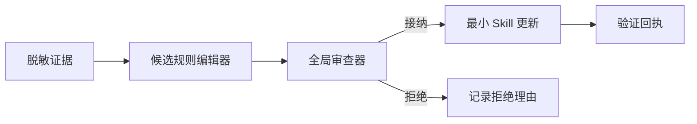
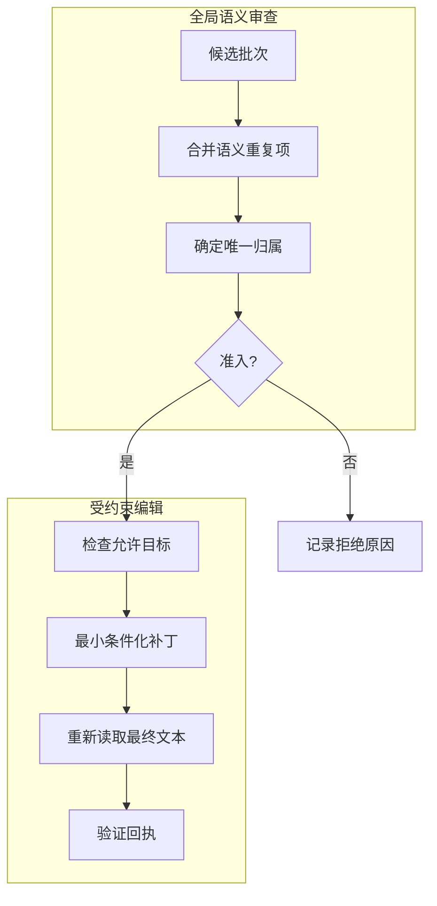
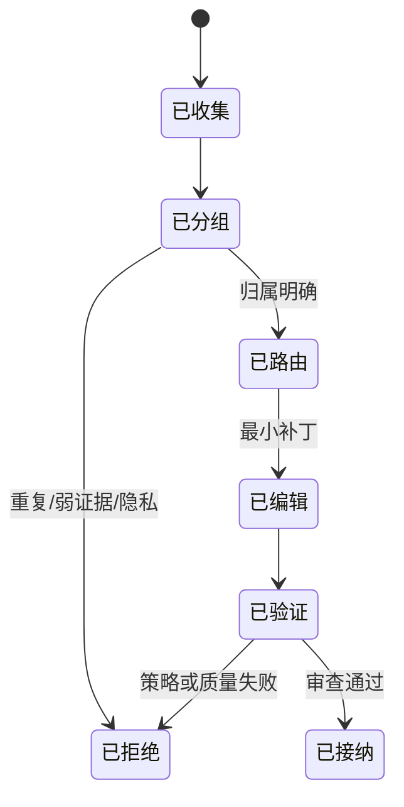

# Agent Skill Governance

中文 · [English](README.md)

这是一份与具体实现无关的公开设计说明：如何把嘈杂的 Agent 运行经验，转化为小而可审查的 Skill 更新。

## 创新焦点

1. **每个候选项只有一个语义决策**：先批量去重再编辑，避免同一经验悄悄扩散到多个 Skill。
2. **语言强度与证据强度匹配**：故障边界不能在编辑中被升级成无条件命令。
3. **归属感知准入**：即使经验有价值，只要目标文件不是最窄合法归属，也必须重新路由或拒绝。

仓库关注 Skill 演化中的治理层：

- 只提取脱敏后的证据，不复制敏感上下文；
- 为每个候选规则确定唯一归属；
- 编辑前先合并语义重复项；
- 用“条件—故障—动作”代替无条件结论；
- 让变更保持最小、可追踪、可回退；
- 拒绝证据不足、涉及隐私或过度场景化的候选项。



## 两阶段治理



全局审查器决定语义与归属；局部编辑器只接收狭窄目标，不能自行扩大范围。

## 候选生命周期



## 准入矩阵

| 证据 | 复用范围 | 归属 | 决策 |
| --- | --- | --- | --- |
| 弱 | 任意 | 任意 | 拒绝：证据不足 |
| 强 | 单次场景 | 明确 | 拒绝：过度拟合 |
| 强 | 可复用 | 冲突 | 重新路由或拒绝 |
| 强 | 可复用 | 唯一 | 提出最小编辑 |
| 强 | 可复用 | 唯一但重复 | 拒绝：已有规则 |

## 决策回执示例

```text
候选项: c-017
决策: 接纳
归属: 现有 Skill 的最窄章节
强度: 条件化规则
原因: 故障被独立佐证，并存在受控恢复证据
校验: Schema ✓  去重 ✓  隐私 ✓  最终引用 ✓
```

## 公开 Skill

- [`candidate-skill-editor`](skills/candidate-skill-editor/SKILL.md)：把一条有证据支持的观察转化为边界清晰的编辑建议。
- [`global-skill-reviewer`](skills/global-skill-reviewer/SKILL.md)：跨 Skill 去重、判断归属并作出准入决策。

配套规则位于 [`references/`](references/)。

## 审查清单

- 每个候选项是否恰好得到一个决策？
- 语义重复项是否在编辑前合并？
- 归属是否是最窄的现有事实源？
- 规则是否保留触发条件？
- 表述是否强于证据支持的程度？
- 读者是否无需私有上下文也能理解？
- 最终引用是否在全部编辑完成后重新读取？

## 主动排除的内容

本仓库不包含任何雇主代码、内部平台术语、生产数据、日志、提示词、凭据、私有路径或专有流程。所有内容均为对通用工程方法的独立公开重构，仅提供 Markdown 文档，不暴露原始实现。

## 状态

求职作品集与设计参考，不是可直接部署的生产框架。

## 许可

当前仅供阅读与讨论；确认复用范围后再添加正式许可证。
