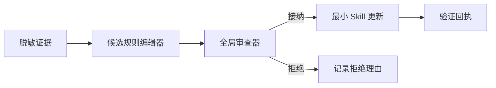

# Agent Skill Governance

中文 · [English](README.md)

这是一份与具体实现无关的公开设计说明：如何把嘈杂的 Agent 运行经验，转化为小而可审查的 Skill 更新。

仓库关注 Skill 演化中的治理层：

- 只提取脱敏后的证据，不复制敏感上下文；
- 为每个候选规则确定唯一归属；
- 编辑前先合并语义重复项；
- 用“条件—故障—动作”代替无条件结论；
- 让变更保持最小、可追踪、可回退；
- 拒绝证据不足、涉及隐私或过度场景化的候选项。

## 公开 Skill

- [`candidate-skill-editor`](skills/candidate-skill-editor/SKILL.md)：把一条有证据支持的观察转化为边界清晰的编辑建议。
- [`global-skill-reviewer`](skills/global-skill-reviewer/SKILL.md)：跨 Skill 去重、判断归属并作出准入决策。

配套规则位于 [`references/`](references/)。

## 主动排除的内容

本仓库不包含任何雇主代码、内部平台术语、生产数据、日志、提示词、凭据、私有路径或专有流程。所有内容均为对通用工程方法的独立公开重构，仅提供 Markdown 文档，不暴露原始实现。

## 状态

求职作品集与设计参考，不是可直接部署的生产框架。

## 许可

当前仅供阅读与讨论；确认复用范围后再添加正式许可证。
